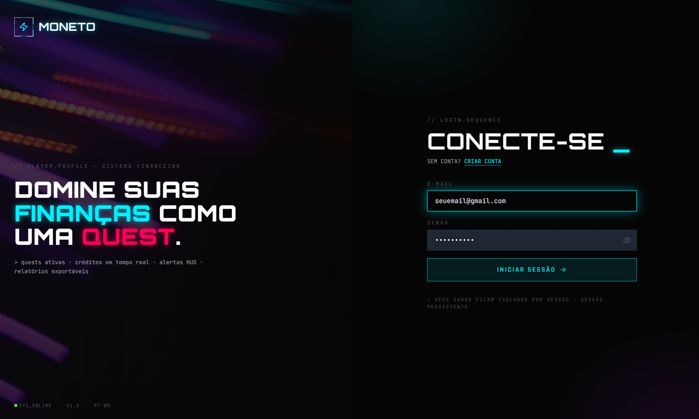
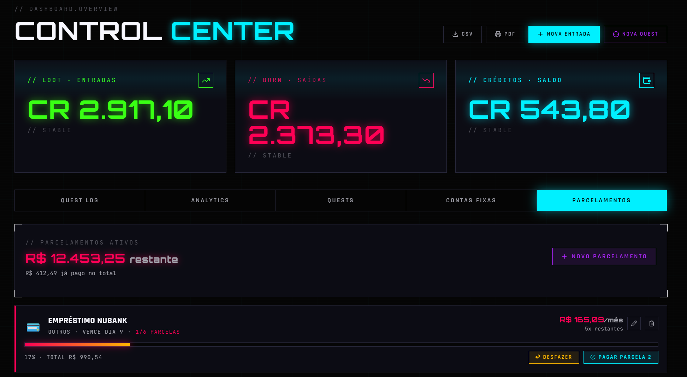
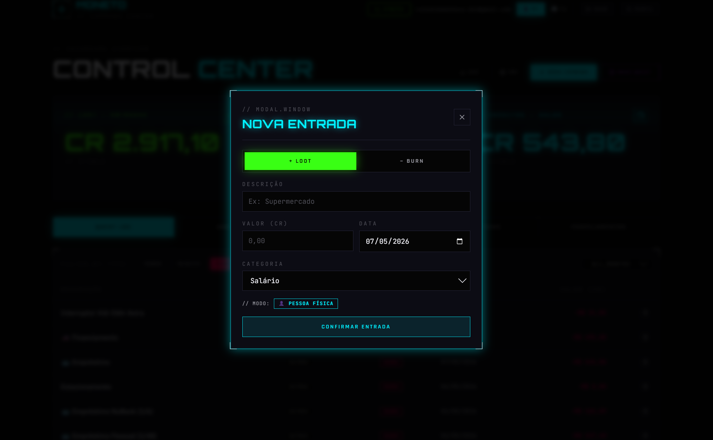
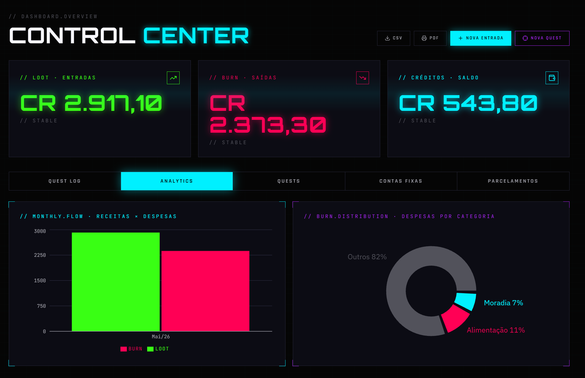
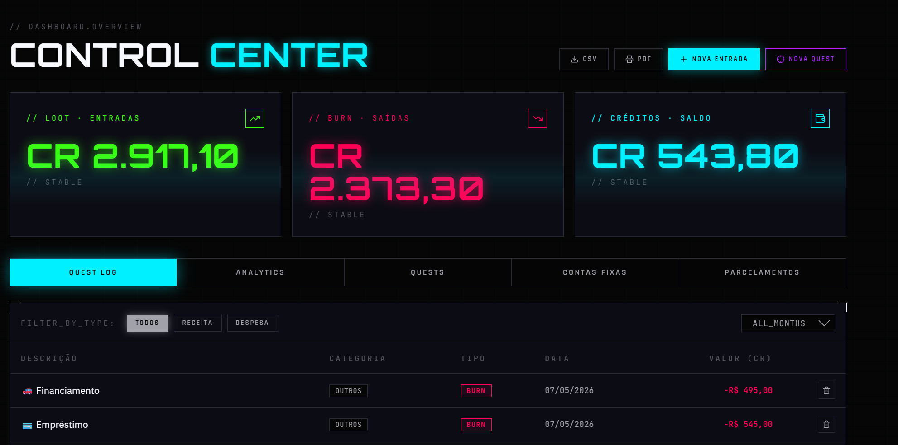

# ⚡ MONETO My Finance

> **"Domine suas finanças como uma Quest."**


---

## 🎮 O que é o MONETO?

**MONETO** é uma plataforma de controle financeiro pessoal com identidade visual gamer/cyberpunk, construída do zero com React, FastAPI e MongoDB.

A proposta é simples: transformar a gestão financeira em algo com a energia de um jogo. Cada receita é um **LOOT**. Cada despesa é um **BURN**. Cada meta financeira é uma **QUEST**. O que torna tudo mais dinâmico e te faz querer avançar para o próximo nível da saúde financeira. 🎮

🔗 **Demo ao vivo:** [monetomyfinance.vercel.app](https://monetomyfinance.vercel.app)

---

## ✨ Funcionalidades

### 🔐 Autenticação

- Cadastro e login com email/senha
- JWT híbrido: access token (1 dia) + refresh token (7 dias) via httpOnly cookies
- Proteção contra brute force — bloqueio após 5 tentativas por IP+email
- Isolamento total de dados por usuário

### 💹 Control Center (Dashboard)

- Cards em tempo real: **LOOT** (entradas), **BURN** (saídas), **CRÉDITOS** (saldo)
- Alertas **HUD-WARN** automáticos para metas próximas do prazo e saldo negativo
- Indicador de sincronização em tempo real
- Modo **👤 PF / 🏢 PJ** com categorias dinâmicas por perfil

### 📋 Quest Log (Transações)

- Registro de receitas e despesas com categoria, data e valor
- Filtros por tipo e por mês
- Máscara de moeda BRL em tempo real via `CurrencyInput` reutilizável

### 📊 Analytics

- **BarChart** mensal: Receitas vs Despesas
- **PieChart**: distribuição de despesas por categoria com cores por categoria

### 🏆 Quests (Metas Financeiras)

- Criação de metas com emoji, valor objetivo e prazo
- Barra de XP com progresso dinâmico
- Sistema de depósito parcial (**+ Depositar XP**)
- Alerta automático quando o prazo está crítico (≤ 30 dias)

### 🧾 Contas Fixas

- Checklist mensal com reset automático
- Indicador de vencimento: urgente, em atraso, pago
- Pagamento cria transação automática no Quest Log

### 💳 Parcelamentos

- Controle de parcelas com barra de XP
- Pagar e desfazer pagamento
- Preview automático de valor total vs valor por parcela

### 📤 Exportação

- **CSV** com BOM UTF-8 (compatível com Excel BR)
- **PDF** gerado client-side sem dependências externas

---

## 🛠️ Stack

| Camada          | Tecnologia                    |
| --------------- | ----------------------------- |
| Frontend        | React 19 + CRA + CRACO        |
| Backend         | FastAPI + Uvicorn             |
| Banco de dados  | MongoDB Atlas + Motor (async) |
| Autenticação    | JWT (PyJWT) + bcrypt          |
| Gráficos        | Recharts                      |
| Estilização     | Tailwind CSS                  |
| Ícones          | Lucide React                  |
| Deploy Frontend | Vercel                        |
| Deploy Backend  | Render                        |

---

## 🧠 Decisões técnicas relevantes

**JWT híbrido com httpOnly cookies**

```python
# Access token curto + refresh token longo
# Brute force protection por IP+email
async def check_lockout(identifier: str):
    rec = await db.login_attempts.find_one({"identifier": identifier})
    if rec and rec.get("count", 0) >= 5:
        raise HTTPException(status_code=429, detail="Tente novamente em 15 minutos.")
```

**CurrencyInput reutilizável — princípio DRY**

```jsx
// Toda a lógica de máscara BRL em um componente
// Aplicado em 5 modais com uma linha cada
const handleChange = (e) => {
  const raw = e.target.value.replace(/\D/g, "");
  const num = (parseInt(raw, 10) / 100).toFixed(2);
  onChange(num);
};
```

**Context API para modo PF/PJ**

```jsx
// Troca de modo = categorias atualizadas em todos os modais
// Persistência automática no localStorage
const { profileType } = useProfileType();
const EXPENSE_CATS =
  profileType === "pj" ? EXPENSE_CATEGORIES_PJ : EXPENSE_CATEGORIES_PF;
```

**useCallback + useEffect sem loop infinito**

```jsx
const fetchData = useCallback(async () => { ... }, [show]);
useEffect(() => { fetchData(); }, [fetchData]);
```

**useMemo para valores derivados**

```jsx
// Totais recalculados APENAS quando transactions muda
const totals = useMemo(() => {
  const income = transactions
    .filter((t) => t.type === "receita")
    .reduce((a, b) => a + Number(b.value), 0);
  return { income, expense, balance: income - expense };
}, [transactions]);
```

---

## 🗄️ Modelagem

```jsx
users
├── transactions  (type, description, value, category, date)
├── goals         (name, emoji, target, saved, deadline)
├── bills         (name, value, category, due_day, emoji)
├── bill_payments (bill_id, month, paid_at)
├── installments  (name, total_installments, paid_installments, installment_value)
└── profiles      (display_name, monthly_income, savings_goal_pct)
```

---

## 🚀 Como rodar localmente

### Backend

```bash
cd backend
pip install -r requirements.txt
# Configure o .env
cp .env.example .env
uvicorn server:app --reload
```

### Frontend

```bash
cd frontend
npm install --legacy-peer-deps
npm start
```


## 📸 Screenshots

| Login                             | Control Center                             | Registro de entradas                                  |   Gráficos para análise                   |  Quests                                |
| --------------------------------- | ------------------------------------------ | ----------------------------------------------------- | ----------------------------------------- | -------------------------------------- |
|  |  |  |  |  |

---

## 📈 Aprendizados

- Arquitetura fullstack desacoplada com FastAPI + React
- Auth segura com JWT híbrido e proteção contra brute force
- Padrões avançados de React: `useMemo`, `useCallback`, Context API
- Princípio DRY com componentes reutilizáveis (`CurrencyInput`)
- Deploy em produção com variáveis de ambiente e CORS configurado
- Design system próprio com Tailwind customizado (HUD cyberpunk)

---

## Autor 🪄

Desenvolvido por **Matheus Reinaldo**

[](https://www.linkedin.com/in/matheus-reinaldo/)
[](https://github.com/reinaldo-matheus/monetomyfinance)
